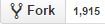
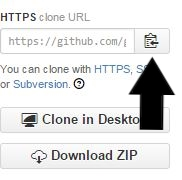

<h1>BeagleWebSite</h1>

<h1> Instructions for Developers </h1>

<h3>Forking</h3>
<ol>
    <li>Click the fork button at the top of the repository </li>
    <li>Go to your github page, and navigate to the repository you just forked</li>
    <li>Clike on the copy link  </li>
    <li>Clone the repository to your local machine</li>
        <ol>
            <li>Open a terminal</li>
            <li>Navigate to a directory where you want to clone the project</li>
            <li>Type <i>git clone [copy the link from earlier]</i></li>
        </ol>
</ol>

<h3> To get the project working locally </h3>
<ol>
    <li>Open a mysql session with the following <i>mysql -u root -p</i> or another user who has permission to create a database</li>
    <li>Type <i>CREATE DATABASE db_beagle</i> You will need this so your project has a database to work with</li>
    <li>Open a terminal and navigate to the directory where you cloned the repository(The directory that contains www)</li>
    <li>Initialize your virtual environment by typing <i>virtualenv env</i></li>
    <li>Activate your virtual environment by typing <i>./venv/Scripts/activate</i> Note you will have to do this every-time you want to do something to your environment, I suggest wriing a script that opens the terminal with it already activated</li>
    <li>Edit the <i>settings.py</i> file as necessary (most likely the database settings), however revert these before making a pull request. </li>
</ol>

<h3><a href="https://help.github.com/articles/fork-a-repo/#step-3-configure-git-to-sync-your-fork-with-the-original-spoon-knife-repository">Keeping your repository in sync with the main repository</a></h3>
<ol>
    <li>Navigate to the <a href="https://github.com/AdamLeBlanc/BeagleWebSite">main repository</a></li>
    <li>Copy the copy button</li>
    <li>Open a terminal and change directories to where you have the fork of your repository</li>
    <li>type <i>git remote add upstream [link you copied]</i></li>
    <li>Now you will be able to pull changes from the main repository, so if there is a change there you can sync it up with your repository. It is recomended to fetch from the main repository often, as this is the "official version" of the code.</li>
</ol>

<h3>Standards</h3>
<ul>
    <li>Make sure you comment code well</li>
    <li>Python code should pass pep8 and pyflakes linters</li>
    <li>Only commit source code and resources. Review what you are tracking before you commit, and make necessary adjustments to the .gitignore file.</li>
    <li>Static resources should go into the static folder</li>
    <li>The one exception is any resources used in the readme should go into the README_resources file, as these will not be deployed to the mainserver</li>
    <li>Each app should have it's own template directory</li>
    <li>Have as little dependencies as possible between apps</li>
    <li>Make use of branches to implement changes, or create new apps</li>
    <li>If you want something done create an entry in the TODO file</li>
    <li>If you don't know what to do look in the TODO file</li>
    <li>Add design mockups to the mockup folder</li>
    <li>Group mockups appropriately, use good names for the files, and try to include a text description of each mockup you submit</li>
    <li>Try to use proper spelling and grammar, mistakes happen though so if you see a mistake fix it</li>
    <li>Use lower case tags in HTML5</li>
    <li>Do not motify the LICENSE File</li>
    <li>View specific templates should be bundled with the view, site wide templates should be stored with the project</li>
</ul>

<h3>A final Note<h3>

If you would like to be listed as a Collaborator so you can approve pull request, and other the other goodies that come along with it send an email to AdamLeBlanc; if you have shown your commitment to the project, and that you can be trusted making important decisions he will add you as a collaborator.

